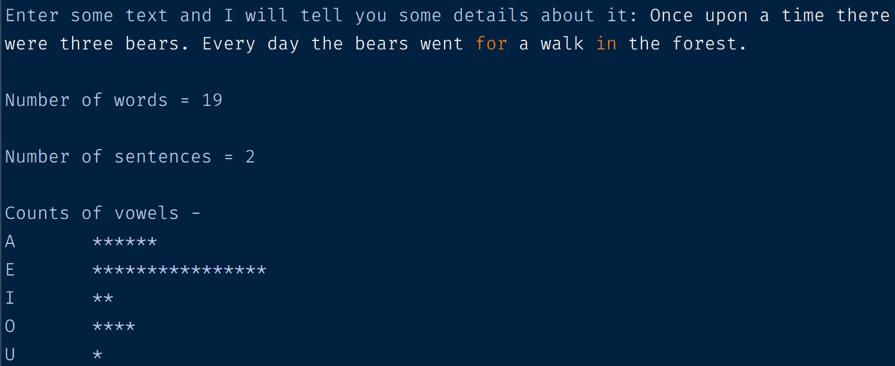

# Analyse an inputted paragraph
To begin, I use the input() function to prompt the user for some text. I then create a _count_ and a _total_ list. The former is a list containing five vowels, a space (' '), and a full stop ('.'). The latter is an empty list created for later appendage.

I iterate through the inputted text (which is formatted to be all in lower case for easier comparison) using a for loop. During the iteration process, whenever it encounters the character that is exactly the same as one of the elements of the count list, that character will be appended to the total list.

After the iteration process, in order to count the number of words of the inputted text, we could count the number of spaces (' ') in the total list, plus 1. The reason for this is that the number of words is equal to the number of spaces plus 1. For example, 'Hello World has two words, equalling to one space plus 1.

In order to count the number of sentences, we could simply just count the number of full stops ('.'), given that a sentence always ends with a full stop.

Finally, the last step is not to count the number of vowels, but to display it as a star ('*'). In order to do this, I first count the number of each vowel by calculating that vowel in the total list. I then use a for loop to repeatedly print the number of stars corresponding to the numbers of that vowel. I do that process inside another for loop to make it repeat 5 five times. In this case, I use a for loop in place of a while loop as the number of repeated times is known, also making my code simpler.

# Output

